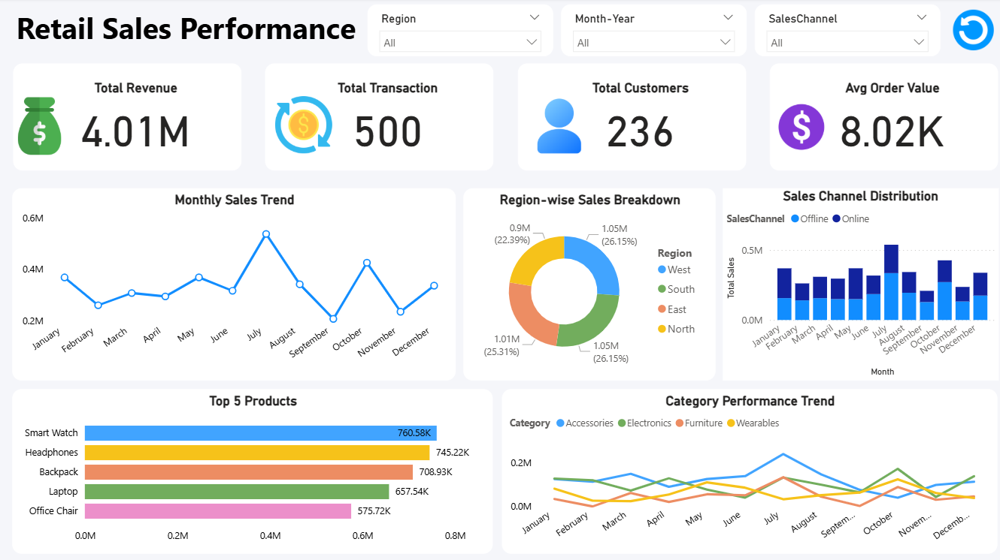

# 🛍️ Retail Sales Performance Dashboard

## 📊 Overview
This project presents an interactive **Retail Sales Performance Dashboard** built to analyze key business metrics such as revenue, customer behavior, sales trends, and product performance.

The goal of this dashboard is to transform raw retail data into **actionable insights** that can support better decision-making.

---

## 🚀 Key Insights
- 💰 Total Revenue: 4.01M  
- 🛒 Total Transactions: 500  
- 👥 Total Customers: 236  
- 📦 Average Order Value: 8.02K  

---

## 🔍 Dashboard Features
- **Monthly Sales Trend** – Track sales performance over time  
- **Region-wise Sales Breakdown** – Compare sales across regions  
- **Sales Channel Distribution** – Analyze online vs offline sales  
- **Top 5 Products** – Identify best-performing products  
- **Category Performance Trend** – Understand category-wise growth patterns  

---

## 🛠️ Tools & Skills Used
- Power BI  
- Data Cleaning & Transformation  
- Data Visualization  
- Dashboard Design  
- Business Insight Generation  

---

## 📈 Learning Outcome
This project helped me:
- Understand how to structure and visualize business data  
- Identify trends and patterns in retail sales  
- Build interactive dashboards for better storytelling  
- Improve decision-making through data-driven insights  

---

## 📸 Dashboard Preview

---

## ⭐ If you like this project
Give it a ⭐ on GitHub and feel free to share your feedback!
